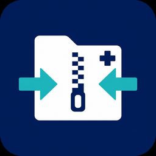

# Sergas ZIP Shrinker


<p align="center">
  
</p>

[](LICENSE)
[](#descarga-usuarios)
[](https://www.rust-lang.org/)
[](#idioma)
[](#descarga-usuarios)

Ferramenta de escritorio para **reducir os ZIP** descargados de **e-Saúde (SERGAS)** eliminando o visualizador Alma3D e outros ficheiros innecesarios. 
O resultado é un ZIP máis pequeno con só o contido DICOM, apto para abrilo en visualizadores estándar como **Weasis**.

> PRIVADA: Esta aplicación NON accede a e-saúde nin ao Sergas. Tampouco almacena ningún tipo de información persoal.

> LOCAL: Esta aplicación non fai seguemento de datos nin envía ou captura ningunha clase de información.

> **Non oficial.** Este proxecto **non está afiliado** ao SERGAS nin a e-Saúde. Os nomes e marcas citados pertencen aos seus respectivos titulares.

## Que fai

1. Escolle ou arrastra **un ou varios** ZIP.
2. Mostra tamaño de entrada, saída estimada e aforro.
3. Xera `nome_reduced.zip` no mesmo cartafol.
4. Pregunta se queres borrar o ZIP orixinal.

## Ver os ficheiros DICOM con Weasis

Para abrir os estudos médicos do ZIP reducido, recoméndase [**Weasis**](https://weasis.org/en/getting-started/download-dicom-viewer/), un visualizador DICOM libre e multiplataforma (Windows, macOS e Linux). Podes instalalo desde a [páxina oficial de descarga](https://weasis.org/en/getting-started/download-dicom-viewer/) ou cos xestores de paquetes indicados alí (por exemplo `flatpak`, `snap` ou `winget`).

> **Aviso médico.** Esta ferramenta e o visualizador só serven para **consultar** os teus ficheiros. **Non te autodiagnostiques.** Ante dúbidas sobre a túa saúde, consulta sempre a unha profesional sanitaria cualificada.

> **Privacidade.** Gardar e controlar a propia información de saúde é un **dereito**. Debemos defendelo: non compartas estudos con datos persoais sen necesidade, e evita subir ZIP reais a Internet ou a repositorios públicos.

## Descarga (usuarios)

Na páxina de **[Releases](https://github.com/pvianag/encolledor_imaxes_sergas/releases)** descarga **só o executábel** da túa plataforma. Sen instalador.

| Plataforma | Ficheiro |
|---|---|
| Linux x86_64 | `sergas-zip-shrinker-linux-x86_64` |
| Windows x86_64 | `sergas-zip-shrinker-windows-x86_64.exe` |
| macOS Intel | `sergas-zip-shrinker-macos-x86_64` |
| macOS Apple Silicon | `sergas-zip-shrinker-macos-aarch64` |

- **Linux:** `chmod +x sergas-zip-shrinker-linux-x86_64 && ./sergas-zip-shrinker-linux-x86_64`
- **Windows:** executar o `.exe`
- **macOS:** `chmod +x` e abrir; se o sistema o bloquea, permite a app en *Seguridade e privacidade*

Podes arrastrar **varios ZIP á vez**. Cada saída gárdase como `nome_reduced.zip` no mesmo cartafol.

## Idioma

Galego por defecto. Tamén: español, inglés, francés e portugués (bandeiras na ventá).

## Desenvolvemento

```bash
cargo run --release
./scripts/package-all.sh          # Linux + Windows → dist/
```

Publicar release multi-OS (Linux, Windows, macOS Intel/ARM) en GitHub:

```bash
git tag v1.0.0 && git push origin v1.0.0
```

Detalles en [`DISTRIBUTION.md`](DISTRIBUTION.md).

Configuración local: `imaxes_diag_shrinker.cfg` no cartafol de configuración do usuario.

## Privacidade no repositorio

Este repositorio **non contén** estudos clínicos nin ZIP reais de pacientes. Non subas mostras con datos persoais a GitHub. A confidencialidade dos datos de saúde é un dereito; protéxeos e non os expós innecesariamente.

## Licenza

[GPL-3.0-or-later](LICENSE)
